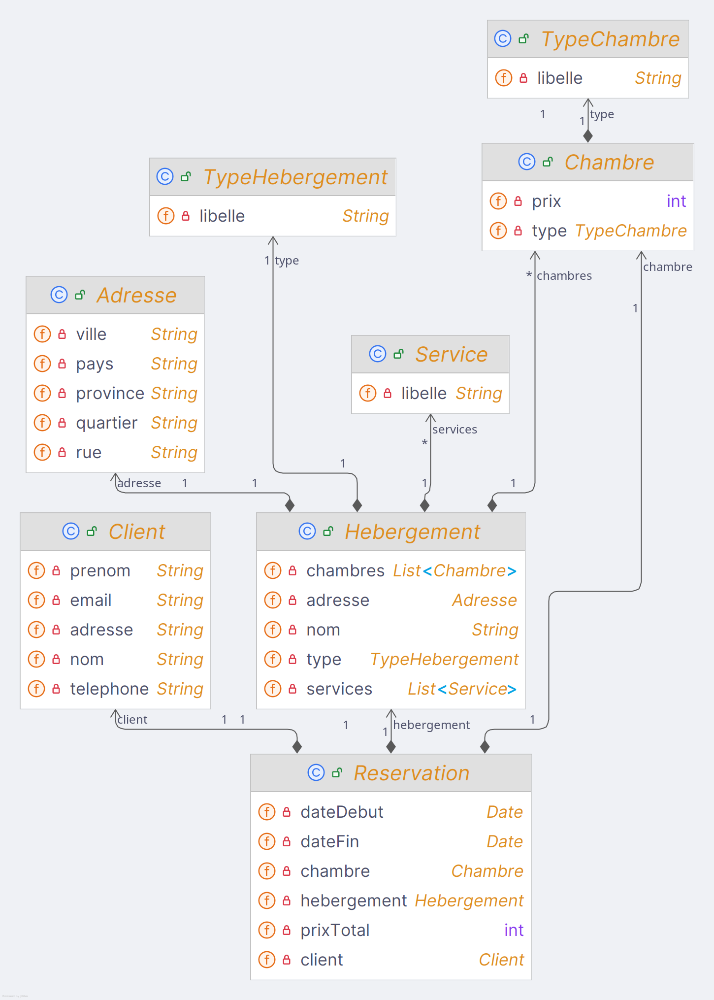
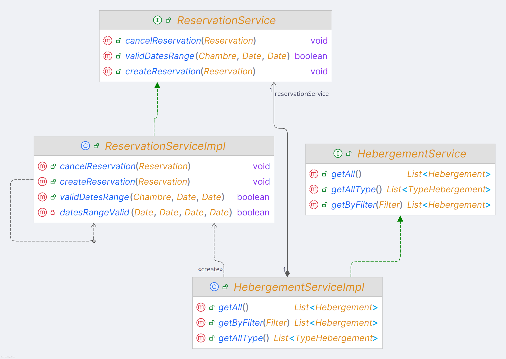

# TP-1 8INF957
Théo Laminie - LAMT03080200\
Matthieu Flaceliere - FLAM30090200

## Déscriptif

Ce TP a pour but de créer une application de gestion de réservation de chambres.\
L'utilisatuer peut rechercher des chambres disponible avec les critères suivants:
- Type d'hébergement
- Adresse
- Type de chambre
- Services
- Dates du séjour
- Prix maximum

Il peut ensuite réserver une chambre avec les informations personnelles du client. L'utilisateur peut également annuler une réservation.

## Architecture de l'application

### Diagramme de classe de l'application:


**Hebergement**: Class représentant un hébergement\
**Chambre**: Class représentant une chambre\
**Reservation**: Class représentant une réservation\
**Client**: Class représentant un client\
**TypeChambre**: Class représentant un type de chambre\
**TypeHebergement**: Class représentant un type d'hébergement\
**Service**: Class représentant un service\
**Adresse**: Class représentant une adresse d'un hébergement\

Toutes les classes business héritent de la classe Entity qui permet de gérer l'identifiant unique de chaque objet.

### Digramme de service de l'application:



**HebergementServiceImpl**: Service qui implémente l'interface HebergementService permettant de gérer les hébergements. Il abstrait les méthodes de la couche de persistance (HebergementRepository)\
**ReservationServiceImpl**: Service qui implémente l'interface ReservationService permettant de gérer les réservations. Il abstrait les méthodes de la couche de persistance (ReservationRepository)\

### Repository de l'application:

La couche de persistance est gérée par les repository.\
Nous avons créer une classe GenericRepository qui contient une liste de nos repositories.\
Cette class nous permet d'obtenir un singleton pour chaque repository.

```java
GenericRepository<Hebergement> hebergementRepository = GenericRepository.getInstance(Hebergement.class);
```

### Filtrage des hébergements:

Nous avons implémenté un filtre pour les hébergements.\
Cette class utilise le design pattern builder pour construire un filtre.

```java
Filter filter = new Filter.Builder()
                .setType(typeHebergement)
                .setServices(services)
                .setDateDebut(dateDebut)
                .setDateFin(dateFin)
                .setMaxPrix(maxPrix)
                .build();
```

## Trace d'exécution

```
/home/matthieu/.jabba/jdk/default/bin/java -javaagent:/home/matthieu/.local/share/JetBrains/Toolbox/apps/intellij-idea-ultimate/lib/idea_rt.jar=35851:/home/matthieu/.local/share/JetBrains/Toolbox/apps/intellij-idea-ultimate/bin -Dfile.encoding=UTF-8 -classpath /home/matthieu/Documents/Master/M2/Object/8INF957-TP1/out/production/8INF957-TP1 main.Main
----------------------------------------------------------------------------------------------------

Création de 100 hébergements
Fin de la création 100 hébergements 

----------------------------------------------------------------------------------------------------

Test filtre sur les hébergements 

Filtre: type=Hôtel, adresse=Non spécifié, typeChambre=Non spécifié, dateDebut=08/10/2024, dateFin=15/10/2024, maxPrix=1000, services=piscine intérieure, cuisinette, 

Résultat du filtre: 2 hébergements 

30 - Hôtel La mer 29
  Adresse: 46 Via Monte Napoleone, Altstadt, Munich, Catalogne, Canada
  Services: [piscine intérieure, cuisinette]
  Chambres disponibles: [Chambre Deluxe à 96$, Chambre Double à 107$, Chambre Familiale à 86$, Chambre Double à 50$, Chambre Deluxe à 102$, Chambre Deluxe à 100$]
76 - Hôtel Les étoiles 75
  Adresse: 98 Avenue des Champs-Élysées, Quartier Latin, Paris, Catalogne, Canada
  Services: [piscine intérieure, stationnement, cuisinette]
  Chambres disponibles: [Chambre Deluxe à 143$, Suite à 92$, Chambre Deluxe à 67$, Chambre Double à 99$, Chambre Deluxe à 133$, Chambre Deluxe à 113$]
----------------------------------------------------------------------------------------------------

Test reservation d'une chambre 

Réservation: Reservation 1 du 08/10/2024 au 15/10/2024 pour Jean Dupont (jeandupont@mail.com, 0123456789, 17 rue de la paix) dans la chambre Chambre Deluxe à 96$ pour un total de 672$

Réservation effectuée avec succès 

----------------------------------------------------------------------------------------------------

Test reservation d'une chambre déjà réservée 

Réservation: Reservation 1 du 08/10/2024 au 15/10/2024 pour Jean Dupont (jeandupont@mail.com, 0123456789, 17 rue de la paix) dans la chambre Chambre Deluxe à 96$ pour un total de 672$

Erreur: La chambre n'est pas disponible pour cette période
----------------------------------------------------------------------------------------------------

Herbergements après réservation la chambre n'est plus disponible 

30 - Hôtel La mer 29
  Adresse: 46 Via Monte Napoleone, Altstadt, Munich, Catalogne, Canada
  Services: [piscine intérieure, cuisinette]
  Chambres disponibles: [Chambre Double à 107$, Chambre Familiale à 86$, Chambre Double à 50$, Chambre Deluxe à 102$, Chambre Deluxe à 100$]
76 - Hôtel Les étoiles 75
  Adresse: 98 Avenue des Champs-Élysées, Quartier Latin, Paris, Catalogne, Canada
  Services: [piscine intérieure, stationnement, cuisinette]
  Chambres disponibles: [Chambre Deluxe à 143$, Suite à 92$, Chambre Deluxe à 67$, Chambre Double à 99$, Chambre Deluxe à 133$, Chambre Deluxe à 113$]
----------------------------------------------------------------------------------------------------

Annulation de la réservation 

Réservation annulée avec succès 

----------------------------------------------------------------------------------------------------

Herbergements après annulation de la réservation la chambre est de nouveau disponible 

30 - Hôtel La mer 29
  Adresse: 46 Via Monte Napoleone, Altstadt, Munich, Catalogne, Canada
  Services: [piscine intérieure, cuisinette]
  Chambres disponibles: [Chambre Double à 107$, Chambre Familiale à 86$, Chambre Double à 50$, Chambre Deluxe à 102$, Chambre Deluxe à 100$]
76 - Hôtel Les étoiles 75
  Adresse: 98 Avenue des Champs-Élysées, Quartier Latin, Paris, Catalogne, Canada
  Services: [piscine intérieure, stationnement, cuisinette]
  Chambres disponibles: [Chambre Deluxe à 143$, Suite à 92$, Chambre Deluxe à 67$, Chambre Double à 99$, Chambre Deluxe à 133$, Chambre Deluxe à 113$]

Process finished with exit code 0
```

## Exécution du programme

### Clonez le projet:
```bash
git clone https://github.com/MatthieuFlaceliere/8INF957-TP1
```

Importez le projet dans votre IDE (IntelliJ IDEA par exemple) et exécutez le fichier Main.java.

### Importer le projet dans IntelliJ IDEA

Cliquez sur "Open..." > Sélectionnez le dossier du projet > Cliquez sur "Open"> Exécutez le fichier Main.java
